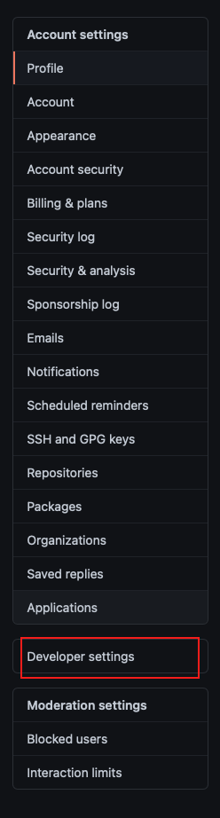
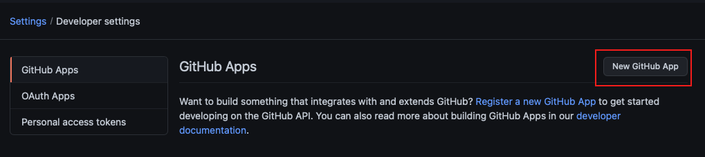
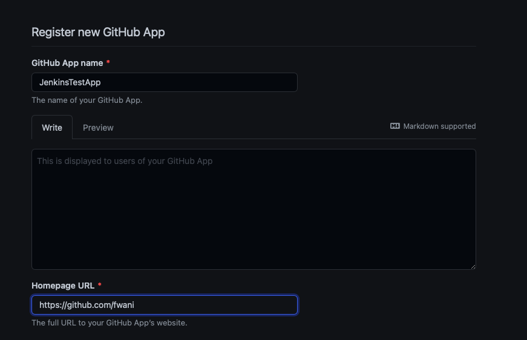
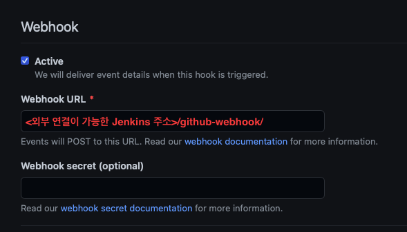
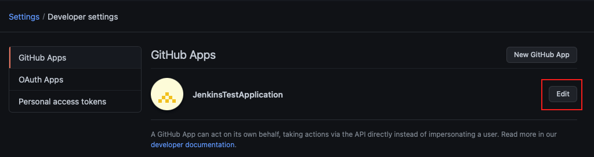
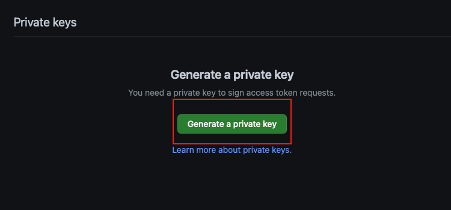
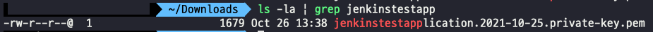
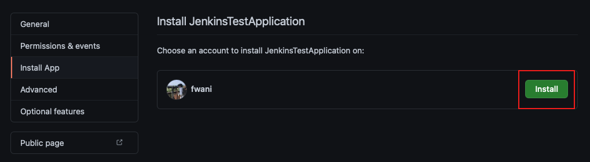
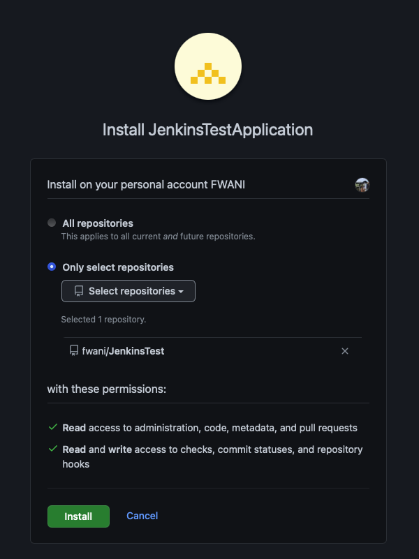

# Github 과 Jenkins 연결

- github 과 jenkins 를 연결하는 방법은 여러가지가 있지만, 여기서는 github 의 App 을 사용하여 연결을 한다.
- 젠킨스 설치는 [젠킨스 설치](./Install-Jenkins-Docker.md) 

## 1. GitHub App 생성하기

1. **profile > Settings** 에 들어가서, **Developer settings** 선택

   

2. **GitHub Apps** 창에서 **New GitHub App** 선택

   

3. 필요한 정보 입력

   1. **GitHub App name** 에 App 의 이름 입력

   2. **Homepage URL** 에 github repository url 입력

      

   3. **Webhook URL** 에 외부에서 연결이 가능한 jenkins 의 url 을 입력하고, 뒤에 `/github-webhook/` 을 입력 (마지막 `/` 는 항상 입력 해야함)

   

4. **Repository permissions** 세팅

   1. **Administration:** Read-only
   2. **Checks:** Read & write
   3. **Contents:** Read-only (`git fetch` 를 통해서 `Jenkinsfile` 과 다른 파일을 가져오기 위함)
   4. **Metadata:** Read-only
   5. **Pull requests:** Read-only
   6. (Optional)**Webhooks:** webhook 을 관리하기 위한 플러그인을 사용하면, Read & write 로 설정
   7. **Commit statuses:** Read & write

5. **Subscribe to events** 세팅

   1. Check run
   2. Check suite
   3. Pull request
   4. (Optional)**Pull request review comment**
   5. Push
   6. Repository

6. **Where can this GitHub App be installed?** 선택

   1. **Only on this account:** 오직 나의 계정에만 설치 할 수 있는 권한
   2. **Any account:** 모든 user 와 organization 에 설치 할 수 있는 권한
      - organization 의 경우는 해당 조직 관리자의 승인을 받으면 설치 가능

7. **Create GitHub App** 버튼을 클릭하여 생성

## 2. GitHub App 의 private key 생성하기

1. **profile > Settings** 에 들어가서, **Developer settings** 선택

2. **GitHub Apps** 창에서 위에서 만들었던 App 의 **Edit** 버튼 클릭

   

3. 아래쪽으로 스크롤을 하여 **Private keys** 의 **Generate a private key** 버튼 클릭

   

4. private key 가 생성이 되면서 **PEM** 포멧의 파일이 로컬 컴퓨터로 다운로드 된다

5. **Terminal** 을 이용해서 다운로드 폴더에 들어간다

   

6. 다운로드한 private key 를 아래 명령어를 사용해서 jenkins 에서 사용가능한 포멧으로 변환한다

   ```bash
   openssl pkcs8 -topk8 -inform PEM -outform PEM -in <다운로드한 pem 파일>.pem -out converted-jenkinstestapplication.pem -nocrypt
   ```

## 3. GitHub App 설치하기

1. **profile > Settings** 에 들어가서, **Developer settings** 선택

2. **GitHub Apps** 창에서 위에서 만들었던 App 의 **Edit** 버튼 클릭

3. 왼쪽의 **Install App > Install** 클릭

   

4. 설치할 repositories 선택 후 설치

   - **All repositories:** 모든 repo 에 install
   - **Only select repositories:** 선택한 repo 만 install

   

## 4. Jenkins credential 추가하기

1. **Manage Jenkins > Manage Credentials > (global) > Add Credentials** 선택

2. **Kind > GitHub App** 선택

3. **ID**, **App ID(github app 에 정보)** 입력

4. **Terminal** 에서 아래 명령어를 이용해서 위에서 만든 privete key 의 내용 복사

   ```bash
   cat converted-jenkinstestapplication.pem
   ```

5. **Key > Add**  에 붙여넣기

6. **OK**

## 참고

- [GitHub App 설정 문서](https://docs.cloudbees.com/docs/cloudbees-ci/latest/traditional-admin-guide/github-app-auth)


## 깃헙

- https://github.com/fwani/JenkinsTest
