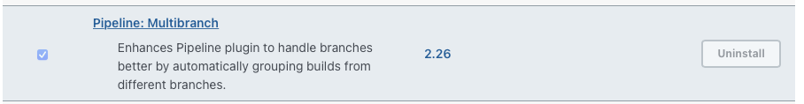

# Jenkins Multibranch Pipeline 이용하기

## 1. Multibranch Pipeline Plugin 설치하기

1. **Manage Jenkins > Manage Plugins** 선택
2. [Pipeline: Multibranch](https://plugins.jenkins.io/workflow-multibranch) 설치



## 2. Multibranch Item 생성하기

1. **Dashboard > New Item** 선택

   

2. 이름 설정 후 **Mulibranch Pipeline** 형태로 생성

3. **Branch Sources > GitHub App** 선택

   

4. **Credentials** 선택

5. **Repository HTTPS URL** 입력

6. **Behaviors** 상황에 맞게 선택

   

7. **Build Configuration** 에 **Jenkinsfile** 의 경로 입력

   

8. **Save**

## 3. Jenkinsfile 작성하기

1. [Jenkinsfile 사용하기 문서](https://www.jenkins.io/doc/book/pipeline/jenkinsfile/) 를 참고하여 Jenkinsfile 작성
2. Groovy 문법을 사용
3. 예제

```groovy
pipeline {
    agent any

    stages {
        stage('Build') {
            steps {
                echo 'Building..'
            }
        }
        stage('Test') {
            steps {
                echo 'Testing..'
            }
        }
        stage('Deploy') {
            steps {
                echo 'Deploying....'
            }
        }
    }
}
```

## 4. Jenkins build 확인하기

1. github 브랜치로 **Jenkinsfile** 을 push
2. Jenkins Item 에서  **Scan Repository Now 선택 **
3. Jenkinsfile 이 존재하는 모든 branch / PR 이 자동으로 빌드됨
4. 주의
   - github branch 에 push 가 일어날 경우 자동으로 jenkins 빌드를 실행하기 위해서는 github webhook 을 설정 해주어야함
   - [github webhook 설정 과정](https://www.comtec.kr/2021/07/22/jenkins-webhook-설정/) 참고

## 참고

- [Jenkinsfile 사용하기 문서](https://www.jenkins.io/doc/book/pipeline/jenkinsfile/)
- [github webhook 설정 과정](https://www.comtec.kr/2021/07/22/jenkins-webhook-설정/)


## 깃헙

- https://github.com/fwani/JenkinsTest